# Vet Tiere - Booking system

## Overview

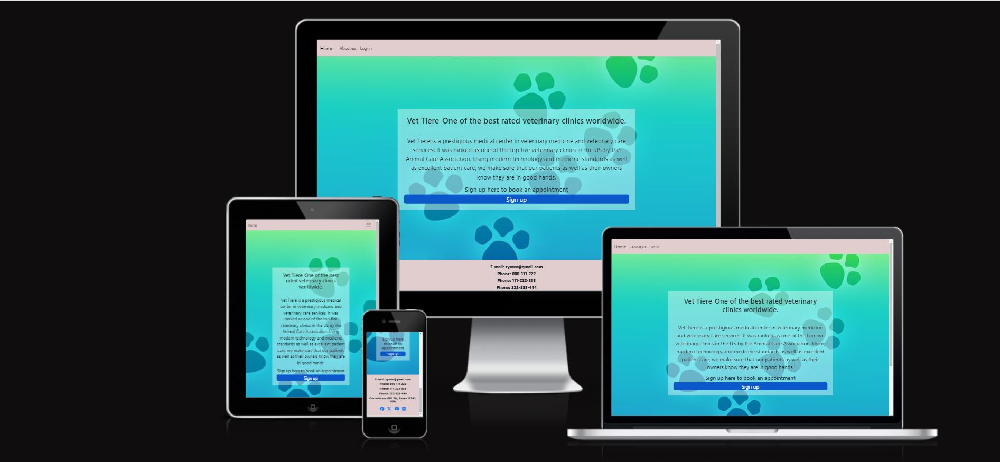

This project was designed and developed to create a simple and easy method for the clients
to book themselves an appointment. The users are given the possibility to book an
appointment, change it and delete it at any time. All these functionalities can be accessed by
any user with an account. The admins have special permissions for controlling the data. The
website was made for real life simulation, although the vet doesn&#39;t exist in real life. The web
site was developed using HTML, CSS, JS, Python &quot;Django&quot; and data are stored in an Elephant
SQL database.
The project can be accessed through this link [Vet Tier](https://ppfour-633113337389.herokuapp.com/).

## Features

 Some elements appear on all of the pages of the website, like navbar, background and the footer.

- Navbar
    - The navigation is fixed at the top of the page and esay to use. It includs three buttons "Home","About-us" and either "log out" when the user logged out or "log in" when the user logged in.

    - Also, the navbar is responsive to different screen sizes.
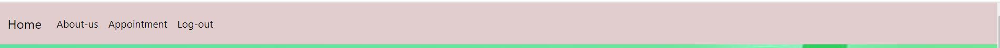

- Footer
    The footer includes the contact of the vet clinic, the address, and social media links.

### Home
This is the main page. It includes an animated paragraph about the history of the clinic. At
the bottom of the paragraph, there is a link to "sign up", if the user is not logged in yet, or a button that takes the user to the appointment panel, if the user is already logged in.

## About us
This page is available to everyone, if they have an account or not. It gives the user a short
introduction to the doctors. This page was made to introduce the vets and to give the user
the option to decide if they want to become their client or not. 
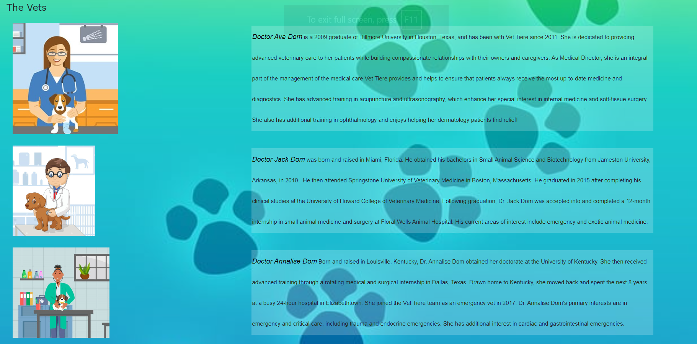

## appointment panel

This page can be accessed only while logged in. This is where the user can book an appointment.

This page includes:

- appointment panel
    - Four inputs "The pet name", "The date", "The time", "Textarea". notace The imee is available for booking an appointment (different options)".

    - Two buttons to submit or reset.

    - Three validation errors that appear: 
        - when the user enters an invalid time
        - when the user books an already booked appointment
        - when the user tries to book more than one appointments

- A link to the information on the appointment
    - This link gives the user the possibility to access the booked appointment including the information.
    - Also, it shows them a message, if they don't have an appointment, to inform them that they don't have one yet.
    - It provides buttons to edit and delete if the user has booked an appointment or an appointment button if the user does not have one.
    - The user receives a confirmation message before the deletion.
    
    - Additionally it includes a Home button, which takes the user to the homepage.
    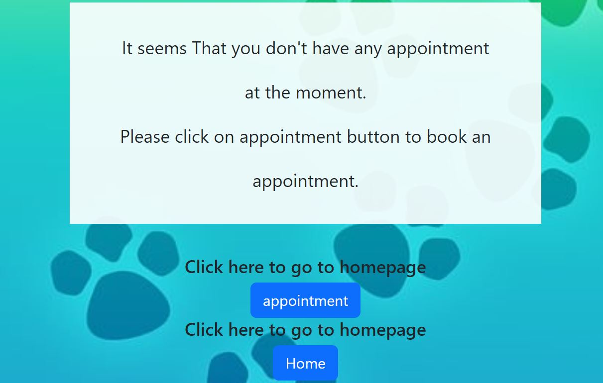

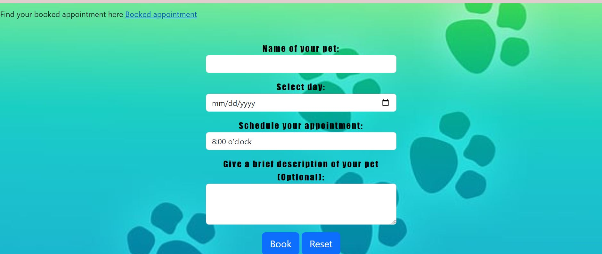

## Sign Up
On the main page, the user can click on "Sign Up" if the user wants to create an account.
It has a link to the log-in page if the user already has an account.
The user has to choose a username and a password that has to be filled-in twice, email is optional. The form has instructions that the user has to follow to be able to create an account.

## Login
On this page, the user only has to enter their username and password to log in to the page.
It has a link to the Sign Up page if the user has no account. The user will automatically be to
the booking panel when it logged in.
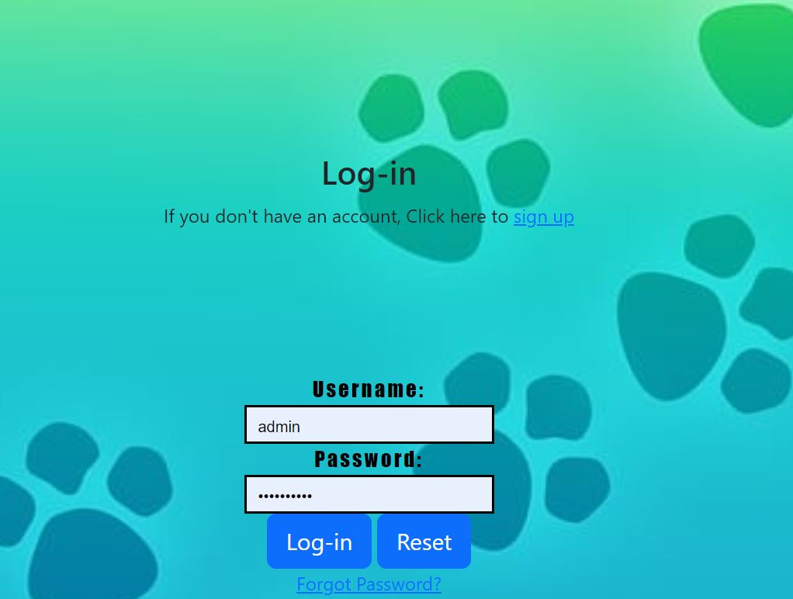

## Logout
When the user is logged in and clicks on "Logout" up on the navigation bar, the user will
automatically be redirected to this page first. The user receives the question if they are sure
they want to log out. To log out they click on the button "Logout"

## UX
### Strategy
- User story

The purpose of the project is to give the possibility for the clients to book an appointment to
see the vet for their pets. They just need to create an account and then log in to access the
appointment panel where they can book their appointment.

In addition, the users have the ability to change (edit) and delete their appointments at any
time, as long as they are logged in. The webiste is easy for the user to navigate through.

Also, any visitor to the website can read about the vets to know who they are before they
decide whether to be a client or not.

    - As a user, I can get to know the doctors&#39; history in order to decide whether to be their client or not.
    - As a user, I can click on the booked appointment link so that I can see my appointment at any time.
    - As a user, I can book an available appointment so that nobody interferes with the appointment.
    - As an admin, I can style the base.HTML page so that I can inherit style to the rest of the HTML pages.
    - As a user, I can book, edit, or delete an appointment so that I have flexibility.
    - As a user, I can ignore the deletion so that I have the chance to keep my appointment.
    - As a user I can sign up so that I have an account to be able to book an appointment.
    - As a user, I can go to profile so that I can make an appointment.
    - As a user I can easily navigate from the home page so that I can access whatever I want without confusion.
    - As an Admin I can create, read, update, and delete the bookings so that I can manage the booking system.
    - As an admin I can create, read, update, and delete the bookings so that I can manage the booking system.
    - As a user I can sign up so that I can have my own profile.

- Project Goal

This Project was created for a vet clinic that is useful for clients and staff members.

### Structure
The user can access the home page and the About Us page without having a profile, but to
access the booking system, the user must create an account. Then the user will have their
own profile so that they can access the booking and booking panel. To schedule an
appointment, the user will receive a text message confirming the appointment with the
ability to modify or delete the appointment. Also, if the user returns to the home page, they
can still come back at any time to edit or delete the appointment.
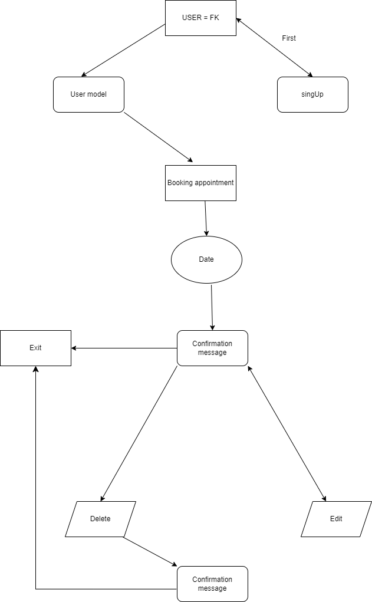

### Scope
- Simple and intuitive User Experience.
- Create a responsive design for desktop, tablet, and mobile devices.
- Add information about location contact and social media.
- Allow access to the Profile page only for client type of users
- Make a clear and easy design for the users
- Create a booking system feature that allows the users to display, edit, and delete the appointment as well as the staff members..
- Create a Profile page for the user, so the user can book an appointment.

### Skeleton
The project uses the ElephentSQL relational database for storing the data. There was just
one diagram created for this project.

### Surface
- Color palette
    - rgba(255, 255, 255, 0.4)
    - rgb(224, 205, 205)
    - Black
    - rgb(138, 119, 15)
    - rgb(224, 205, 205)

- Fonts
imported from fonts.googleapis [google.font](https://fonts.google.com/)
    - Verdana, Geneva, Tahoma, sans-serif
    - Arial, Helvetica

- Visual Effects
    - Flex-box
    - Animation
    - Hover effects
    - Box shadows

## Technologies Used
- [Python](https://www.python.org/) Used for back end and front end
- [Heroku](https://dashboard.heroku.com/) Used for deploying the project
- [GitHub](https://github.com/) Used for hosting the source code of the program
- [Favicon.io](https://www.favicon.cc/) Used for generating the website favicon
- [Cloudinary](https://cloudinary.com/) For storing static data
- [Chrome-Del-Tools](https://developer.chrome.com/docs/devtools/) For debugging the project
- [W3C HTML Validator](https://validator.w3.org/#validate_by_input) Used for validating the HTML
- [CI Python Linter](https://pep8ci.herokuapp.com/#) Used to validating Python
- [Font-Awesome](https://fontawesome.com/) For creating attractive UX with icons
- [Bootstrap5](https://getbootstrap.com/) For adding predefined styled elements and creating responsiveness
- [Google-Fonts](https://fonts.google.com/) for typography
- [JsHint](https://jshint.com/) used for validating the javascript code
- [Jigsaw CSS Validator](https://jigsaw.w3.org/css-validator/) Used for validating the CSS
- [elephantsql](https://www.elephantsql.com/) Where the DB is storing
- [Django](https://www.djangoproject.com/) Used as a framework
- [django-allauth](https://docs.allauth.org/en/latest/) Used for the authorization
- [gunicorn](https://docs.djangoproject.com/en/5.0/howto/deployment/wsgi/gunicorn/)
- [HTML](https://developer.mozilla.org/en-US/docs/Web/HTML) was used as the foundation of the site.
- [CSS](https://developer.mozilla.org/en-US/docs/Web/CSS) was used to add the style and layout of the site.
- [JavaScript](https://developer.mozilla.org/en-US/docs/Web/JAVASCRIPT) was used for interaction
- [Gitpod](https://www.gitpod.io/) Hosted the workspace.
- [app-diagrams](https://app.diagrams.net/) Used to design the RED
- [amiresponsive](https://ui.dev/amiresponsive) Used to check responsive screen

## Deployment
The project was deployed with the following steps:

- Added "DEVELOPMENT" in os.environ to DEBUG in setting.py
- Also add os.environ['DEVELOPMENT'] = "True" in env.py
- Push to GitHub.
- Setting up Heroku
    - Go to the Heroku website [Heroku](https://www.heroku.com/)
    - Login to Heroku and choose Create App
    - Click New and Create a new app
    - Choose a name and select your location
    - Go to the Resources tab
    - From the Resources list select Heroku Postgres
    - Navigate to the Deploy tab
    - Click on Connect to Github and search for your repository
    - Navigate to the Settings tab
    - Click on the "Settings" tab and then on "Reveal Config Vars".
    - Delete "DISABLE_COLLECTSTATIC = 1" from the list.
    - Add CLOUDINARY_URL = API, DATABASE_URL = API, 
    SECRET_KEY = API to the list.
    - Now click on the tab "Deploy" and then on the button "Deploy Branch" at the bottom of the page.
    - When it's deployed, Click on "Open App" to access the website.

- Here is the website [Vet Tier](https://ppfour-633113337389.herokuapp.com/).

## Testing
I have tested the project by the following points

### Validator Testing

- Python
    - Passed the code to [PEP8](https://pep8ci.herokuapp.com/#).
    
    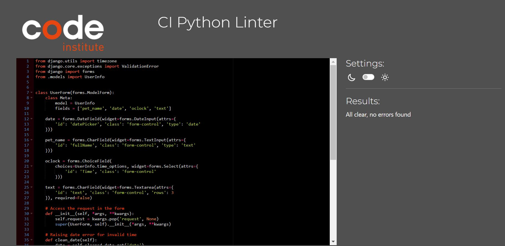
    

- HTML
    - No errors were returned when passing through the official[ W3C validator](https://validator.w3.org/nu/?doc=https%3A%2F%2Fppfour-633113337389.herokuapp.com%2F)
    
    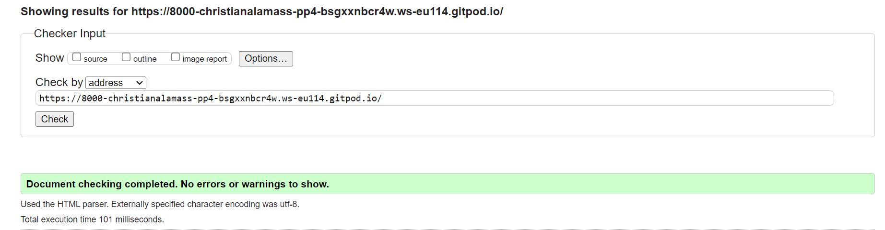
    

- CSS
    - No errors were found when passing through the official [(Jigsaw) validator](https://jigsaw.w3.org/css-validator/validator?uri=https%3A%2F%2Fppfour-633113337389.herokuapp.com%2F&profile=css3svg&usermedium=all&warning=1&vextwarning=&lang=en)
    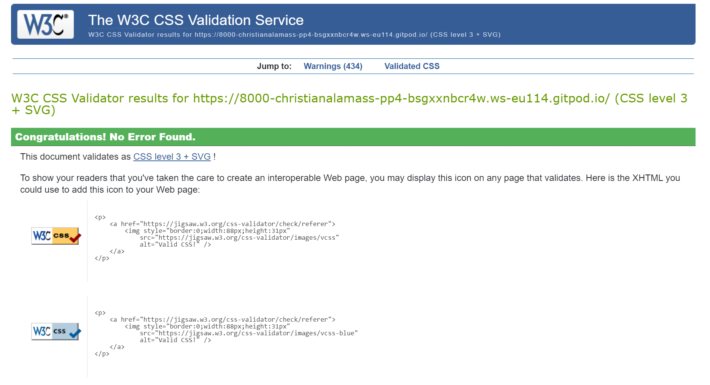

- JavaScript
    - No errors were found when passing through the officia [Jshint validator](https://jshint.com/).
    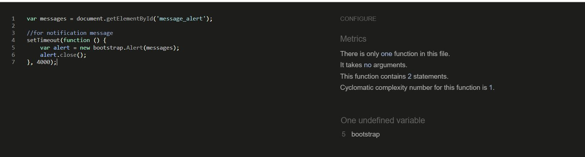

### Manually checking

#### General Tests
- The website has been tested and works on different screen sizes and is responsive.
    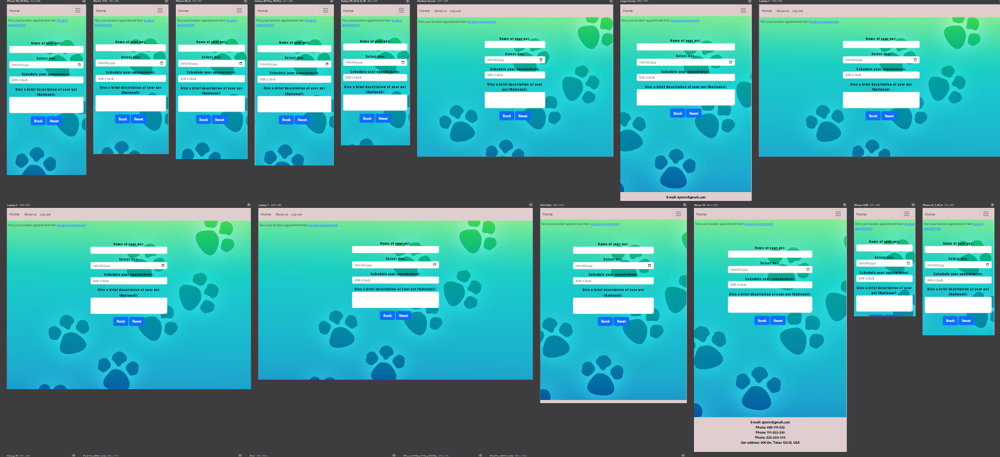
- It has been tested and works in several web browsers such as Firefox and Edge.
- All alerts disappear after four seconds.
- The user can&#39;t book an invalid date or multiple appointments.
- It was made sure that each user had their own appointment.
- The user gets alert messages when they log in or log out.
- The navigation stays at the top of the page.

#### Booking system
- Back end connected with front end.
- It shows a message for the user when they entered an invalid date or multiple appointments or a taken appointment.
- It takes the user to a confirmation message that includes the information of the appointment.
- Delete and Edit are functioning
- It allows the user to delete, edit, and read the appointment at any time.
- It gives the user a chance to undelete the appointment after clicking on delete bottom.

#### Authorization
- Sign-Up
    - The Sign-Up page works good.
    - The link to the Log-in page works correctly.
- Log-in
    - The Log-in page works good.
    - The link to the Sign-Up page works correctly.
    - The user has to enter the user details correctly to be able to log in.
- Log-out
    - The Log-out page works good.
    - The button works good.

### Lighthouse
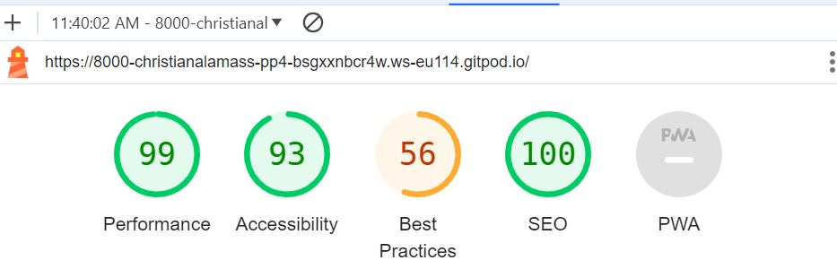

## Bugs

### Fixed bugs
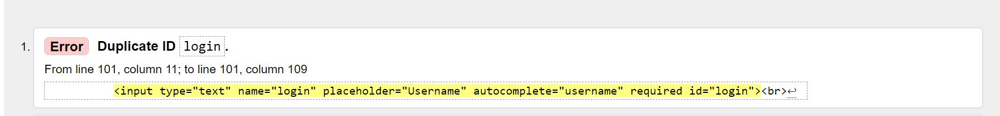
    - The error was solved by deleting the duplicate id.

### Unfixed bugs
- The user can't see the available and unavailable appointments before clicking on the date.

## Diagram

    
## Credits
- inspiration was taken from [Code Institute](https://learn.codeinstitute.net/)
- Icons are from [Font-Awesome](https://fontawesome.com/).
- This website uses [Bootstrap](https://getbootstrap.com/).
- Images on this website are hosted and managed by [Cloudinary](https://cloudinary.com/).
- Fonts are from [Google-Fonts](https://fontawesome.com/).
- This website is powered by [Django](https://www.djangoproject.com/).
- To check representative screen [amiresponsive](https://ui.dev/amiresponsive).
- Used to test JavaScript [JsHint](https://jshint.com/).
- Used to stor DB [elephantsql](https://www.elephantsql.com/).
- Used to test CSS [Jigsaw CSS Validator](https://jigsaw.w3.org/css-validator/).
- Used to test HTML code W3 [W3C HTML Validator](https://validator.w3.org/#validate_by_input).
- Used for [Favicon](https://www.favicon.cc/).
- Used to design the RED [app-diagrams](https://app.diagrams.net/).
- Used to check resporesponsive screens [responsiveviewer](https://responsiveviewer.org/)
- Media
    - An image was taken from [depositphotos](https://depositphotos.com/vectors/vet-cartoon.html).
    - Images were taken from [123rf](https://www.123rf.com/).
    - An image was taken from [pixabay](https://pixabay.com/).