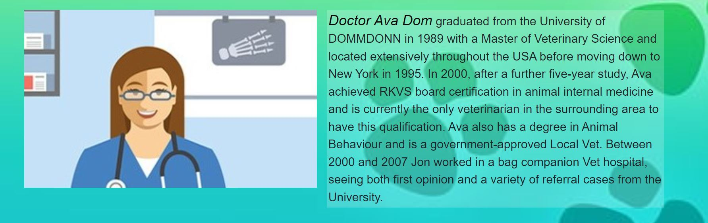

# Vet Tier - Booking system

## Overview

This project designed and developed to create a simpol and esay method for the clints to book themselve an appointment. The users are given the possibility to book an appointment, fix it, and delete it whenever they wnat. All these functionalities can be accessed by any user with an account. The admines have special permissions for controlling the data.
The website was made for real life simulation, although the vet doesn't exist in real life.
The web sit was developed using HTML, CSS, JS, Python "Django" and data are storing in ElephantSQL database.

The project can be accessed at this link [Vet Tier](https://ppfour-633113337389.herokuapp.com/).

## Features

### Some elements apear on all sites-pages, like navbar, background and the footer.

- Navbar
    - The navigation is fixed at the top of the page and esay to use. It includs three buttons "Home","About-us" and either "log out" when the user loged out or "log in" when the user loged in.

    - Also, the navbar is responsive to different screen sizes.

- Footer
    It includes the contact of the vet clinic, the address, and social media links.

### Home
It is the main page. It includes an animated paragraph about the history of the clinic. and at the bottom of the paragraph, there is a link to "sign up" of the user is not logged out or a button that takes the user to the appointment panel if the user is logged in.

## About us
It is available to everyone, either they have an account or not. It gives the user a short introduction to the doctors. This page was made to introduce the vets to give a chance to the user either to be client or not. 

## appointment panel

This page accessed while logged in is where the user can book an appointment.

this page has:
-apointment panel
    - has four inputs "The pet name", "The date", "The time, which it gives some option times that the vets offer" and "Textarea"

    - Two buttons to submit or reset.

    - There are three validation errors it appears 
        - when the user enters an invalid time.
        - when the user books a booked appointment.
        - when the user tries to book more than one appointment.

- A link to where the info on the appointmennt
    - This link gives the user the possibility to access the booked appointment including the information.
    - Also, It shows them a message if they don't have an appointment to inform them that they don't have one yet.
    - Also, It has buttons to edit and delete if the user has booked an appointment or an appointment button if the user has no one.
    - The user receives a confirmation message before the deletion.
    
    -Plus, It has a Home button, Which takes the user to the homepage.

    

## Sign Up
On the main page, The user can click on "Sign Up" if the user wants to create an account.
It has a link to the login page if the user already has an account.
The user has to choose a username and a password that has to be filled in twice, email is optional.
The form has instructions that the user has to follow to be able to create an account.

## Login
On this page, the user only has to enter it's username and password to log in on the page.
It has a link to the Sign Up page if the user has no account.
The user will land on automatically to the booking panel when it logged in.

## Logout
When the user is logged in and clicks on "Logout" up on the navigation bar the user will land on this page first.
The user gets the question if they're sure they want to log out.
To log out they click on the button "Yes, please!"

## UX
### Strategy
- User story

The purpose of the project is to give the possibility for the clients to book an appointment to see the vet for their pets. They just need to create an account and then log in to access the appointment panel where they can book their appointment.

In addition, the users have the ability to fix(edit) and delete their appointments whenever they want. while the users are logged in. It should be easy to navigate through the website.

Also, any visitor to the website can read about the vets to know who they are before they decide whether to be a client or not.

    - As a user I can get to know the doctors' history so that decide whether to be their client or not.
    - As a user I can click on the booked appointment link so that I can see my appointment any time.
    - As a user I can book an available appointment so that nobody interferes the appointment.
    - As an Admin I can style the base.HTML page so that I can inherit style to the rest of the HTML pages.
    - As a User, I can book, edit, or delete an appointment so that I have flexibility.
    - As a user I can ignore the deletion so that I have the chance to keep my appointment.
    - As a User I can sign up so that I have an account to be able to book an appointment.
    - As a User, I can go to profile so that I can make an appointment.
    -  As a user I can easily navigate from the home page so that I can access whatever want without confusion.
    - As an Admin I can create, read, update, and delete the bookings so that I can manage the booking system.
    - As a User I can sign up so that I can have my own profile.
- Project Goal
This Project was created for a vet clinic that is useful for clients and staff members.

### Structure
The user can access the home page and the About Us page without having a profile, but to access the booking system, the user must create an account, then the user will have its own profile so that it can access the booking and booking panel. To schedule an appointment, the user will receive a text message confirming the appointment with the ability to modify or delete the appointment. Also, if the user returns to the home page, they can still come back at any time to edit or delete the appointment.

### Scope
- Simple and intuitive User Experience.
- Create a responsive design for desktop, tablet, and mobile devices.
- Add information about location contact and social media.
- Allow access to the Profile page only for client type of users;
- Make a clear and easy design for the users
- Create a booking system feature that allows the users to display, edit, and delete the appointment as well as the staff members.
- Create a Profile page for the user, so the user can book an appointment.

### Skeleton
The project uses the ElephentSQL relational database for storing the data.
There was created just one diagrams for this project.

### Surface
- Color palette
    - rgba(255, 255, 255, 0.4)
    - rgb(224, 205, 205)
    - Black
    - rgb(138, 119, 15)
    - rgb(224, 205, 205)

- Fonts
    - fantasy
    - Verdana
    - Geneva
    - Tahoma
    - sans-serif
    - Arial
    - Helvetica

- Visual Effects
    - Flex-box
    - Animation
    - Hover effects
    - Box shadows

    ## Diagram
    